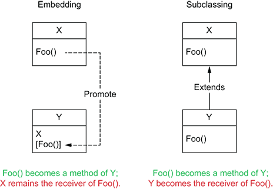

## 2.10 没有意识到类型嵌入可能存在的问题

创建结构时，Go提供了嵌入类型的选项。然而，如果我们不了解类型嵌入的所有影响，这有时可能会导致意想不到的行为。在本节中，让我们提醒我们如何嵌入类型，它带来了什么，以及可能的问题。

在Go中，如果结构字段在没有名称的情况下声明，则称为嵌入式结构字段。例如：

```go
type Foo struct {
        Bar
}

type Bar struct {
        Baz int
}
```

在 `Foo` 结构中，`Bar` 类型声明没有关联名称；因此它是一个嵌入式字段。

嵌入用于提升嵌入式类型的字段和方法。在这里，由于 `Bar` 包含一个 `Baz` 字段，它被提升为 `Foo` ：


图 2.8 `baz` 被提升，因此可以直接从 `S` 访问

因此，`Baz` 可以从 `Foo` 获得：

```go
foo := Foo{}
foo.Baz = 42
```

请注意，`Baz` 可以从两种不同的路径获得。要么来自使用 `Foo.Baz` 的提升，也可以来自名义上的 `Bar`：`Foo.Bar.Baz`。两者都是同一个字段。

# Note

然而，本节的范围仅与结构中的嵌入字段相关。
在接口中还使用嵌入来与其他接口组成接口。例如，`io.ReadWriter` 由 `io.Reader` 和 `io.Writer` 组成。

```go
type ReadWriter interface {
        Reader
        Writer
}
```

现在我们提醒自己什么是嵌入式类型，让我们看看错误用法的例子。我们将实现一个包含一些内存数据的结构，我们希望使用互斥体保护它免受并发访问：

```go
type InMem struct {
        sync.Mutex
        m map[string]int
}

func New() *InMem {
        return &InMem{m: make(map[string]int)}
}
```

我们决定不导出map，以便客户端不能直接与它交互，只能通过导出的方法。同时，互斥场被嵌入。因此，我们可以这样实现 `Get` 方法：

```go
func (i *InMem) Get(key string) (int, bool) {
        i.Lock()
        v, contains := i.m[key]
        i.Unlock()
        return v, contains
}		
```

由于 mutex 被嵌入，我们可以直接从 `i` 接收器访问 `Lock` 和 `Unlock` 方法。

我们一开始提到，这样一个例子是类型嵌入的错误用法。但原因是什么呢？由于 `sync.Mutex` 是一种嵌入式类型，因此将提升 `Lock` 和 `Unlock` 方法。因此，使用 `InMem` 的外部客户端也可以看到这两种方法：

```go
m := inmem.New()
m.Lock() // ??
```

这种提升可能并不理想。在大多数情况下，mutex 是我们希望封装在结构中并使外部客户端看不见的东西。因此，在这种情况下，我们不应该将其作为嵌入式字段：

```go
type InMem struct {
        mu sync.Mutex
        m map[string]int
}
```

由于 mutex 没有嵌入和未导出，因此无法从外部客户端访问它。

现在让我们看看另一个例子，但这次，嵌入可以被认为是一种正确的方法。我们希望编写一个包含 `io.WriteCloser` 的自定义日志记录器，并公开两种方法：`Write` 和 `Close`。如果 `io.WriteCloser` 没有嵌入，我们必须这样写：

```go
type Logger struct {
        writeCloser io.WriteCloser
}

func (l Logger) Write(p []byte) (int, error) {
        return l.writeCloser.Write(p)
}

func (l Logger) Close() error {
        return l.writeCloser.Close()
}

func main() {
        l := Logger{writeCloser: os.Stdout}
        _, _ = l.Write([]byte("foo"))
        _ = l.Close()
}
```

`Logger` 必须同时提供 `Write` 和 `Close` 方法，只需将调用转发到 `io.WriteCloser` 。但是，如果该字段现在嵌入，我们可以删除以下转发方法：

```go
type Logger struct {
        io.WriteCloser
}

func main() {
        l := Logger{WriteCloser: os.Stdout}
        _, _ = l.Write([]byte("foo"))
        _ = l.Close()
}

```

client保持不变：两种导出的 `Write` 和 `Close` 方法。然而，它阻止仅仅为了转发调用而实施这些额外的方法。此外，随着 `Write` 和 `Close` 的提升，这意味着 `Logger` 满足 `io.WriteCloser` 接口。

# Note

将嵌入与OOP子类化区分开来有时会令人困惑。主要区别在于谁是方法的接收者。

让我们看看下图。左侧表示嵌入在 `Y` 中的 `X` 类型，而在右侧，`Y` 扩展 `X`：



图 2.9 通过嵌入，嵌入类型仍然是方法的接收者。相反，通过子类，子类成为方法的接收者。

通过嵌入，`Foo` 的接收器仍然是 `X`。然而，有了子类，`Foo` 的接收器变成了子类 `Y`。嵌入是关于组成，而不是继承。

那么，关于类型嵌入，我们应该得出什么结论？

首先，让我们注意一下，这(提升)很少是必要的，这意味着无论用例是什么，我们可能也可以在没有类型嵌入的情况下解决它。它主要用于方便，在大多数情况下是为了提升行为。

如果我们决定使用类型嵌入，我们必须牢记两个主要约束：

* 简化访问字段（例如，`Foo.Baz()` 而不是 `Foo.Bar.Baz()` ）不应该仅仅因为一些语法糖。如果这是唯一的理由，我们不要嵌入内部类型，而是使用字段。
* 它不应该提升数据（字段）或我们想隐藏的行为（方法）。例如，如果它允许client访问应该对结构保持私有的锁定行为。

# Note

人们还可能认为，使用类型嵌入可能会导致在导出结构背景下进行维护的额外努力。事实上，在导出的结构中嵌入类型意味着在这种类型演变时保持谨慎。例如，如果我们在内部类型中添加新方法，我们应该确保它不会破坏后一种约束。因此，为了避免这种额外的努力，团队还可以防止类型嵌入到公共结构中。

通过牢记这些约束，有意识地使用类型嵌入，可以通过额外的转发方法帮助避免模式化代码。然而，让我们确保我们这样做不仅仅是为了美化代码，而不是提升本应隐藏的元素。

在下一节中，现在让我们讨论处理选项配置的常见模式。