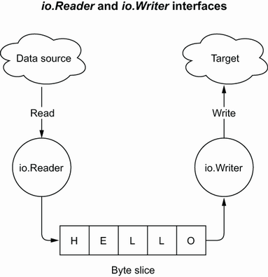

## 2.5 接口污染

在设计和构建我们的代码时，接口是 `Go` 语言的基石之一。然而，像许多工具或概念一样，滥用它通常不是一个好主意。接口污染是用不必要的抽象来压倒我们的代码，使其更难理解。这是来自具有不同习惯的另一种语言的开发人员所犯的常见错误。在深入探讨这个主题之前，让我们重新思考一下 `Go` 的接口。然后，我们将看到何时适合使用接口以及何时可能被视为污染。

### 2.5.1 概念

接口提供了一种指定对象行为的方法。接口用于创建多个对象可以实现的通用抽象。Go 接口如此不同的原因在于它们是隐式满足的。没有像 `implements` 这样的显式关键字来标记对象 `X` 实现了接口 `Y`。

要了解是什么让接口如此强大，我们将从标准库中挖掘两个流行的接口：`io.Reader` 和 `io.Writer`。

`io` 包为 `I/O` 原语提供抽象。在这些抽象中，`io.Reader` 涉及从数据源读取数据，`io.Writer` 涉及将数据写入目标，如下图所示：



`io.Reader` 包含了一个 `Read` 方法：

```go
type Reader interface {
        Read(p []byte) (n int, err error)
}
```

`io.Reader` 接口的自定义实现应该接受一个字节切片参数，用它的数据填充它并返回读取的字节数量或返回错误。

另一方面，`io.Writer` 定义了一个方法：`Write`。

```go
type Writer interface {
        Write(p []byte) (n int, err error)
}
```

`io.Writer` 的自定义实现应该将来自切片的数据写入目标，并返回写入的字节数或返回错误。

因此，这两个接口都提供了基本都抽象：

* `io.Reader` 从源读取数据。
* `io.Write` 将数据写入目标。

在语言中使用这两个接口的基本原理是什么？创建这些抽象的意义何在？

假设我们必须实现一个将一个文件内容复制到另一个文件的函数。我们可以创建一个特定的函数，将两个 `*os.File` 作为输入。或者，我们可以选择使用 `io.Reader` 和 `io.Writer` 抽象创建一个更通用的函数：

```go
func copySourceToDest(source io.Reader, dest io.Writer) error {
        // ...
}
```

该函数适用于 `*os.File` 参数（因为 `*os.File` 实现了 `io.Reader` 和 `io.Writer`）以及任何其他可以实现这些接口的类型。例如，我们可以创建自己的 `io.Writer` 来写入数据库，并且代码将保持不变。它增加了函数的通用性；因此，它是可重用的。

此外，为这个函数编写单元测试更容易，因为我们不必处理文件，我们可以使用提供实现的 `strings` 和 `bytes` 包：

```go
func TestCopySourceToDest(t *testing.T) {
        const input = "foo"
        source := strings.NewReader(input)
        dest := bytes.NewBuffer(make([]byte, 0))

        err := copySourceToDest(source, dest)
        if err != nil {
                t.FailNow()
        }

        got := dest.String()
        if got != input {
                t.Errorf("expected: %s, got: %s", input, got)
        }
}
```

`source` 是 `*strings.Reader` 而 `dest` 是 `*bytes.Buffer`。在这里，我们在不创建任何文件的情况下测试 `copySourceToDest` 的行为。

此外，在设计接口时，需要牢记粒度（接口包含多少方法）。 Go 中的一句著名谚语与接口应该有多大有关：

接口越大，抽象越弱。

实际上，向接口添加方法会降低其可重用性。 `io.Reader` 和 `io.Writer` 是强大的抽象，因为它们不能变得更简单。此外，还可以组合细粒度的接口来创建更高级别的抽象。结合了读取器和写入器行为的 `io.ReadWriter` 就是这种情况：

```go
type ReadWriter interface {
        Reader
        Writer
}
```

> **Note** 正如爱因斯坦所说，“一切都应该尽可能容易，但不能简单”。应用于接口，它表示找到接口的完美粒度不一定是一个简单的问题。

现在让我们讨论推荐接口的常见情况。

### 2.5.2 什么时候使用接口？

我们什么时候应该在 Go 中创建接口？让我们深入研究三个具体的使用通常认为接口带来价值的情况。请注意，目标并不是详尽无遗，因为我们添加的案例越多，它们就越依赖于上下文。但是，这三种情况应该给我们一个大致的概念：

* 常见行为
* 解耦
* 限制行为

**常见行为**

我们将讨论的第一个选项是在多种类型实现共同行为时使用接口。在这种情况下，我们可以分解出接口内部的行为。

如果我们查看标准库，我们可以找到许多此类用例的示例。例如，可以通过三种方法对集合进行排序：

* 检索集合中的元素数量。
* 报告一个元素是否必须在另一个元素之前排序。
* 交换两个元素。

因此，`sort` 包中添加了以下接口：

```go
type Interface interface {
        Len() int
        Less(i, j int) bool
        Swap(i, j int)
}
```

该接口具有强大的可重用潜力，因为它包含对任何基于索引的集合进行排序的常见行为。

在整个 `sort` 包中，我们可以找到几十个实现。例如，如果在某个时候我们计算了一个整数集合，并且我们需要对其进行排序，我们是否一定对实现类型感兴趣？例如，排序算法是归并排序还是快速排序是否重要？在许多情况下，我们不在乎。 因此，排序行为可以被抽象化，我们可以依赖于 `sort.Interface`。

找到正确的抽象来分解行为也可以带来很多好处。例如，`sort` 包提供了同样依赖于 `sort.Interface` 的实用函数，例如检查一个集合是否已经排序：

```go
func IsSorted(data Interface) bool {
        n := data.Len()
        for i := n - 1; i > 0; i-- {
                if data.Less(i, i-1) {
                        return false
                }
        }
        return true
}
```

由于 `sort.Interface` 是正确的抽象级别，因此它非常有价值。

现在让我们看看使用接口时的另一个主要用例。

**解耦**

另一个重要的用例是将我们的代码与实现解耦。如果我们依赖抽象而不是具体的实现，那么实现本身就可以被另一个实现替换，甚至无需更改我们的代码；这就是里氏替换原则（SOLID 中的 L）。

例如，解耦的一个好处可能与单元测试有关。假设我们必须实现一个 `CreateNewCustomer` 方法来创建一个新客户并存储它。我们可以决定直接依赖具体的实现（比如说一个 `mysql.Store` 结构）：

```go
type CustomerService struct {
        store mysql.Store
}

func (cs CustomerService) CreateNewCustomer(id string) error {
        customer := Customer{id: id}
        return cs.store.StoreCustomer(customer)
}
```

现在，如果我们想测试这个方法怎么办？由于 `customerService` 依赖于实际实现来存储需要启动 `MySQL` 实例的 `Customer` 集成测试（除非我们使用诸如 `go‑sqlmock` 之类的替代技术，但这不是本节的范围）。尽管集成测试很有帮助，但它并不总是我们想要做的。为 了给我们更大的灵活性，我们应该将 `CustomerService` 与实际实现分离，这可以通过如下接口完成：

```go
type customerStorer interface {
        StoreCustomer(Customer) error
}

type CustomerService struct {
        storer customerStorer
}

func (cs CustomerService) CreateNewCustomer(id string) error {
        customer := Customer{id: id}
        return cs.storer.StoreCustomer(customer)
}
```

由于存储客户现在是通过接口完成的，因此我们可以更灵活地测试方法：

* 通过集成测试进行具体实现。
* 通过单元测试使用模拟（或任何类型的测试替身）
* 或者以上两者都用。

现在让我们讨论另一个限制行为的用例。

**限制行为**

我们将讨论的最后一个用例乍一看可能非常违反直觉。这是关于将类型限制为特定行为。

假设我们已经实现了一个自定义配置包来处理动态配置。我们通过一个 `IntConfig` 结构为 `int` 配置创建了一个特定的容器，该结构还公开了两个方法 `Get` 和 `Set`：

```go
type IntConfig struct {
        // ...
}

func (c *IntConfig) Get() int {
        // Retrieve configuration
}

func (c *IntConfig) Set(value int) {
        // Update configuration
}
```

现在，假设我们收到一个 `IntConfig`，其中包含一些特定的配置，例如阈值。然而，在我们的代码中，我们只对检索配置值感兴趣，并且我们希望阻止更新它。如果我们不想更改我们的配置包，我们如何从语义上强制执行此配置是只读配置？通过创建一个将行为限制为仅检索配置值的抽象：

```go
type intConfigGetter interface {
        Get() int
}
```

然后，在我们的代码中，我们可以依赖 `intConfigGetter` 而不是具体的实现：

```go
type Foo struct {
        threshold intConfigGetter
}

func NewFoo(threshold intConfigGetter) Foo {
        return Foo{threshold: threshold}
}

func (f Foo) Bar()  {
        threshold := f.threshold.Get()
        // ...
}
```

在这个例子中，配置 `getter` 被注入到 `NewFoo` 工厂方法中。它甚至不会影响此函数的调用端，因为它仍然可以传递 `IntConfig` 结构，因为它实现了 `intConfigGetter`。然后，我们只能读取 `Bar` 方法中的配置，不能修改它。

因此，我们还可以出于各种原因使用接口将类型限制为特定行为，例如语义强制。

当接口通常被认为带来价值时，我们已经看到了三种潜在的用例：分解常见行为、创建一些解耦以及将类型限制为特定行为。同样，这个列表并不详尽，但它应该让我们大致了解接口在 Go 中何时有用。

现在，让我们结束本节，讨论接口污染的问题。

### 2.5.3 接口污染

在 Go 项目中过度使用接口是很常见的。也许开发人员的背景是 C# 或 Java，他发现在具体类型之前创建接口是很自然的。但是，这不是 Go 中的工作方式。

正如我们所讨论的，接口是用来创建抽象的。当编程遇到抽象时，主要的警告是记住 **应该发现抽象，而不是创建抽象**。这是什么意思？

这意味着如果没有直接的原因，我们不应该首先在代码中创建抽象。我们不应该使用接口进行设计，而是等待具体的需求。换句话说，我们应该在需要时创建接口，而不是在我们预见到可能需要它时。

如果我们过度使用接口，主要问题是什么？答案是它使代码流更加复杂。添加无用的间接级别不会带来任何价值；它创建了一个无用的抽象，使代码更难阅读、理解和推理。

如果我们没有充分的理由添加接口并且不清楚接口如何使代码变得更好，我们应该挑战这个接口的目的。为什么不直接调用实现呢？

> **Note** 我们还可以注意到通过接口调用方法时的性能开销。它需要在哈希表数据结构中查找以找到它指向的具体类型。然而，这在许多情况下都不是问题，因为这种开销很小。

总之，我们在代码中创建抽象时应该谨慎。同样，应该发现抽象，而不是创建抽象。对于我们软件开发人员来说，通过根据我们认为以后可能需要的东西来猜测什么是完美的抽象级别来过度设计我们的代码是很常见的。应该避免这个过程，因为在大多数情况下，它会用不必要的抽象污染我们的代码，使其阅读起来更加复杂。让我们不要试图抽象地解决问题，而是解决现在必须解决的问题。最后但同样重要的是，如果不清楚接口如何使代码变得更好，我们可能应该考虑删除它以使我们的代码更简单。

> 不要设计接口，要发现它们。--Rob Pike

下一节将讨论一个常见的接口错误，即在生产者端创建接口。