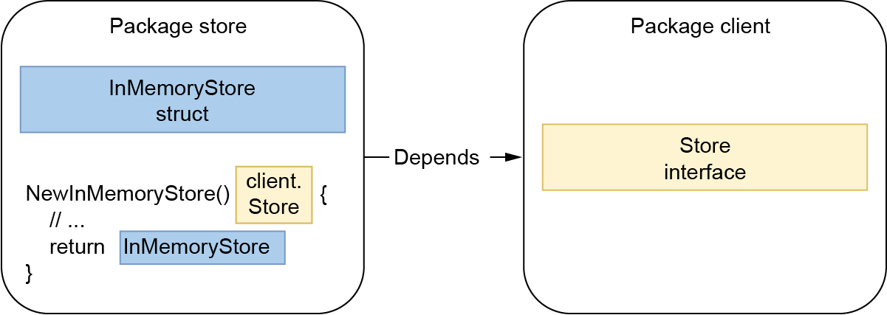

## 2.7 返回接口

在设计函数签名时，我们可能必须返回接口或具体的实现。让我们理解为什么在许多情况下，返回接口被认为是Go中的不良做法。

我们刚刚介绍了为什么接口通常存在于消费侧。让我们看看在[图2.7。从存储包到客户端包都有依赖项。图2.7]()。如果函数返回接口而不是结构，依赖性会发生什么。我们将看到它所导致问题。

我们来分析两个包:

* `client` 包含一个 `Store` 接口
* `store` 包含一个 `Store` 的实现



图 2.7。`store` 包和 `client` 包都有依赖性。

在 `store` 包中，我们定义了一个实现 `Store` 接口的 `InMemoryStore` 结构。与此同时，我们创建一个 `NewInMemoryStore` 函数来返回 `Store` 接口。在这个设计中，从实现包到 client 包都有依赖性，这听起来可能已经有点奇怪了。例如，client 包不能再调用 `NewInMemoryStore` 函数；否则，将存在循环依赖项。 一个可能的解决方案是从另一个包调用此函数，并将 `Store` 实现注入到 `client` 。然而，被迫这样做意味着设计应该受到挑战。

此外，如果另一个 client 使用 `InMemoryStore` 结构，会发生什么？在这种情况下，也许我们想把 `Store` 接口移到另一个包裹上？或者放回到实现包，但我们讨论了为什么在大多数情况下，这不是最好的实践方案。所以再说一遍，它看起来像一种代码气味。

因此，一般来说，返回接口会限制灵活性，因为我们强迫所有 client 使用一种特定的抽象类型。

在大多数情况下，我们可以从 Postel 定律中获得灵感：

在你做的事情上要保守，在接受别人的东西时要开明。

如果我们将这句习语应用于 Go 语言，这意味着：

* 返回值用结构替代接口
* 如果可能接受接口

当然，总有一些例外。作为软件工程师，我们非常熟悉这样一个事实，即在100%的情况下，规则从来都不总是正确的。最相关的是 `error` 类型，这是许多函数返回的接口。我们还可以使用 `io` 包检查标准库中的另一个异常：

```go
func LimitReader(r Reader, n int64) Reader {
    return &LimitedReader{r, n}
}
```

在这里，该函数返回一个引用的结构：`io.LimitedReader`。然而，函数定义的返回值是一个接口：`io.Reader`。

那么，打破我们目前讨论的规则的理由是什么？`io.Reader` 是一个预先定义的抽象。它不是由 client 定义的，但它是一个强制的，因为语言设计者预先知道这种抽象级别是有用的（例如，在重用性和可组合性方面）

总而言之，在大多数情况下，我们不应该返回接口，而应该返回具体的实现。否则，由于包依赖性，它可能会使我们的设计更加复杂，并限制灵活性，因为所有 client 都必须依赖相同的抽象。同样，结论与前几节相似：如果我们知道（没有预见到）抽象对 client 有帮助，我们可以考虑返回一个接口。否则，我们不应该强迫抽象，它们应该被 client 发现。如果 client 出于任何原因需要抽象实现，它仍然可以在他那一侧这样做。

在下一节中，我们将讨论一个与使用 `any` 相关的常见错误。
