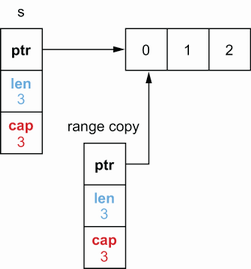
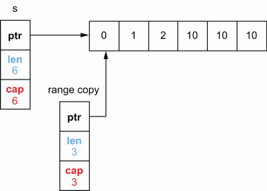
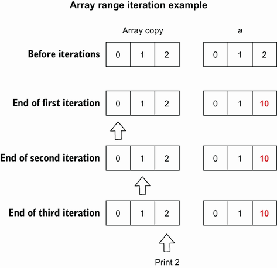

## 4.2 忽略 `range` 循环中参数的计算方式

`range` 循环语法需要一个表达式。例如，在 `for i, v:= range exp` 中，`exp` 是表达式。正如我们所见，它可以是字符串、数组、指向数组的指针、切片、映射或通道。现在，让我们讨论以下问题：如何评估这个表达式？在使用范围循环时，避免常见错误是 `range` 循环的一个要点。

让我们看一下以下示例，该示例将元素附加到我们迭代的切片。你相信循环会终止吗？

```go
s := []int{0, 1, 2}
    for range s {
            s = append(s, 10)
    }
```

要理解这个问题，我们应该知道，当使用 `range` 循环时，提供的表达式只在循环开始之前被计算一次。在这种情况下，评估意味着提供的表达式被复制到一个临时变量，然后 `range` 将遍历这个变量，而不是原始变量。

在这个例子中，当 `s` 表达式被求值时，它会产生一个切片拷贝。



`range` 循环将使用这个临时变量。此外，原始切片s在每次迭代期间都会更新。因此，经过3次迭代后，状态如下：



每一步都会导致附加一个新元素。但是，经过三个步骤，我们遍历了所有元素。实际上，范围使用的临时切片仍然是3长度切片。因此，循环在三次迭代后完成。

对于经典的 `for` 循环，行为会有所不同：

```go
s := []int{0, 1, 2}
for i := 0; i < len(s); i++ {
    s = append(s, 10)
}
```

在此示例中，循环永远不会结束。实际上，在每次迭代期间都会评估 `len(s)` 表达式。随着我们不断添加元素，我们将永远不会达到终止状态。为了准确使用 Go 循环，必须牢记这种差异。

回到 `range` 运算符，我们应该知道我们描述的行为（表达式只计算一次）也适用于所有提供 的数据类型。作为一个例子，我们将看到这种行为对另外两种类型的影响：通道和数组。

### 4.2.1 通道

让我们看一个基于使用 `range` 循环在通道上迭代的具体示例。

我们将创建两个 goroutine，都将元素发送到两个不同的通道。然后，在父 goroutine中，我们将使用 `range` 循环在一个通道上实现消费者，该循环将在迭代期间尝试切换到另一个通道：

```go

ch1 := make(chan int, 3)
go func() {
    ch1 <- 0
    ch1 <- 1
    ch1 <- 2
    close(ch1)
}()

ch2 := make(chan int, 3)
go func() {
    ch2 <- 10
    ch2 <- 11
    ch2 <- 12
    close(ch2)
}()

ch := ch1
for v := range ch {
    fmt.Println(v)
    ch = ch2
}
```

在此示例中，适用有关如何评估范围表达式的相同逻辑。提供给 `range` 的表达式是指向 `ch1` 的 `ch` 通道。因此 `range` 评估 `ch`，对临时变量执行复制，并迭代来自该通道的元素。尽管有 `ch = ch2` 语句，但 `range` 将继续迭代 `ch1` ，而不是 `ch2`。

```go
0
1
2
```

不过，`ch = ch2` 语句并非无效。当我们将 `ch` 分配给第二个变量时，如果我们在这段代码之后调用`close(ch)` ，它将关闭第二个通道，而不是第一个。

现在让我们看看数组的影响。

### 4.2.2 数组

对数组使用 `range` 循环有什么影响？由于 `range` 表达式是在循环开始之前计算的，因此分配给临时循环变量的是数组的副本。让我们通过以下在迭代期间更新特定数组索引的示例来看看这个原理的实际作用：

```go
a := [3]int{0, 1, 2}
    for i, v := range a {
            a[2] = 10
            if i == 2 {
                    fmt.Println(v)
            }
    }
```

此代码将最后一个索引更新为10。但是，如果我们运行此代码，它不会打印 10，而是打印 2，如下图所述：



正如我们所提到的，`range` 运算符创建了数组的副本。同时，循环不会更新副本；它更新原始数组：`a`。因此，最后一次迭代中 `v` 的值是 2，而不是 10。

如果我们想打印最后一个元素的实际值，可以实现：
* 通过从其索引访问元素：
```go
a := [3]int{0, 1, 2}
for i := range a {
    a[2] = 10
    if i == 2 {
        fmt.Println(a[2])
    }
}
```
* 使用数组指针
```go
a := [3]int{0, 1, 2}
for i, v := range &a {
        a[2] = 10
        if i == 2 {
                fmt.Println(v)
        }
}
```

这两个选项都有效。但是，第二个选项不会导致复制整个数组，如果数组非常大，可能需要记住这一点。

总之， `range` 循环仅在循环开始之前通过复制（无论类型如何）对提供的表达式求值一次。我们应该记住这种行为，以避免会导致我们的常见错误，例如，访问错误的元素。

在下一节中，我们将看到如何使用带指针的 `range` 循环来避免常见错误。