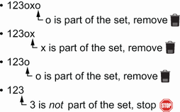

## 5.3 被滥用的 trim 函数

Go 开发人员在使用 `strings` 包时常犯的一个错误是将 `TrimRight` 和 `TrimSuffix` 混合使用。事实上，这两个函数的用途相似，而且很容易混淆它们。让我们来看看它。

在以下示例中，我们将使用 `TrimRight`。这段代码应该输出什么？

```go
fmt.Println(strings.TrimRight("123oxo", "xo"))
```

答案是 `123`。是你所期待的吗？如果不是，您可能会期待 `TrimSuffix` 的结果。让我们回顾一下这两个函数。



`TrimRight` 向后迭代每个符文。如果符文是提供的集合的一部分，它将移除它。如果不是，它会停止迭代并返回剩余的字符串。这就是该函数返回 `123` 的原因。

另一方面，`TrimSuffix` 返回一个没有提供尾随后缀的字符串：

```go
fmt.Println(strings.TrimSuffix("123oxo", "xo"))
```

当 `123oxo` 以 `xo` 结束时，此代码打印 `123o`。此外，删除尾随后缀不是重复操作。因此，`TrimSuffix("123xoxo","xo")` 返回 `123xo`。

使用 `TrimLeft` 和 `TrimPrefix` 的字符串左侧的原理相同：

```go
fmt.Println(strings.TrimLeft("oxo123", "ox")) // 123
fmt.Println(strings.TrimPrefix("oxo123", "ox")) /// o123
```

`string.TrimLeft` 删除集合中包含的所有前导符文，因此打印 `123`。此外，`TrimPrefix` 删除提供的前导前缀，因此打印 `o123`。

与此主题相关的最后一件事是，`Trim` 将 `TrimLeft` 和 `TrimRight` 应用于字符串。因此，它删除了集合中包含的所有前导符文和尾随符文：

```go
fmt.Println(strings.Trim("oxo123oxo", "ox")) // 123
```

总之，我们必须明确了解 `TrimRight / TrimLeft` 与 `TrimSuffix / TrimPrefix` 两者之间的区别：

* `TrimRight / TrimLeft` 移除一组中的尾随/前导符文。
* `TrimSuffix / TrimPrefix` 删除给定的后缀/前缀。

在下一节中，我们将深入研究字符串连接。